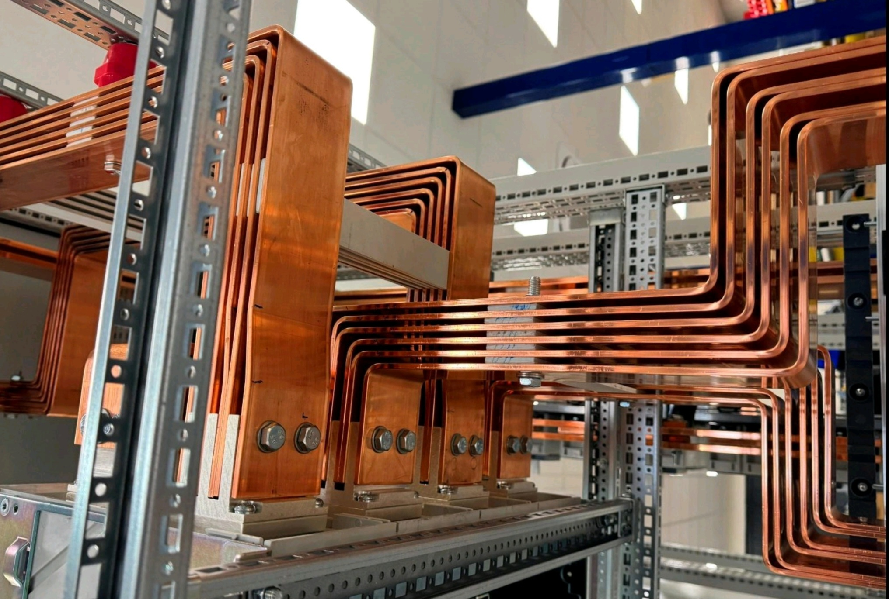

---

# Вас приветствует

  

Входящая в группу компаний ООО «МонолитКомфорт Энерго» предлагает услуги по проектированию, конструкторской разработке, монтажу, пусконаладочным работам и постгарантийному обслуживанию оборудования для энергетической отрасли:

Устройств комплектных низковольтных распределения и управления НКУ «МКЭ» напряжением до 1000 В, как стационарного так и выдвижного исполнения.

Подстанций комплектных трансформаторных КТП «МКЭ» мощностью 63 – 16000кВА, напряжением на стороне ВН 6 – 35 кВ в оболочке из бетона, металла и сэндвич панелей.

Камер сборных одностороннего обслуживания КСО «МКЭ» напряжением 6(10) кВ с автогазовой изоляцией и с применением коммутационной аппаратуры с элегазовой изоляцией.

Комплектных распределительных устройств КРУ «МКЭ» высокотехнологичных распределительных устройств, разработанных с учетом пожеланий монтажных и эксплуатирующих организаций.

Вариант изготовления комплектного распределительного устройства КРУ «МКЭ» с твёрдой изоляцией обеспечивает возможность изготовления классических необслуживаемых моноблоков, в том числе для использования в сетях Smart Grid.

Прямые поставки оборудования и комплектующих ведущих заводов изготовителей и проверенные, надежные решения разработанные персоналом компании обеспечивают высокий экономический эффект и комфортные условия работы.